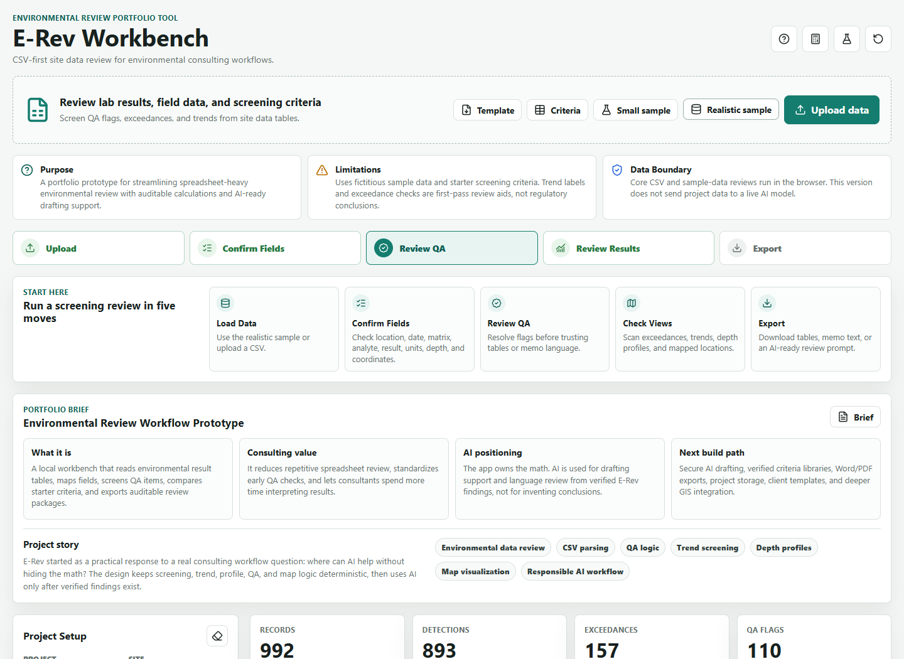
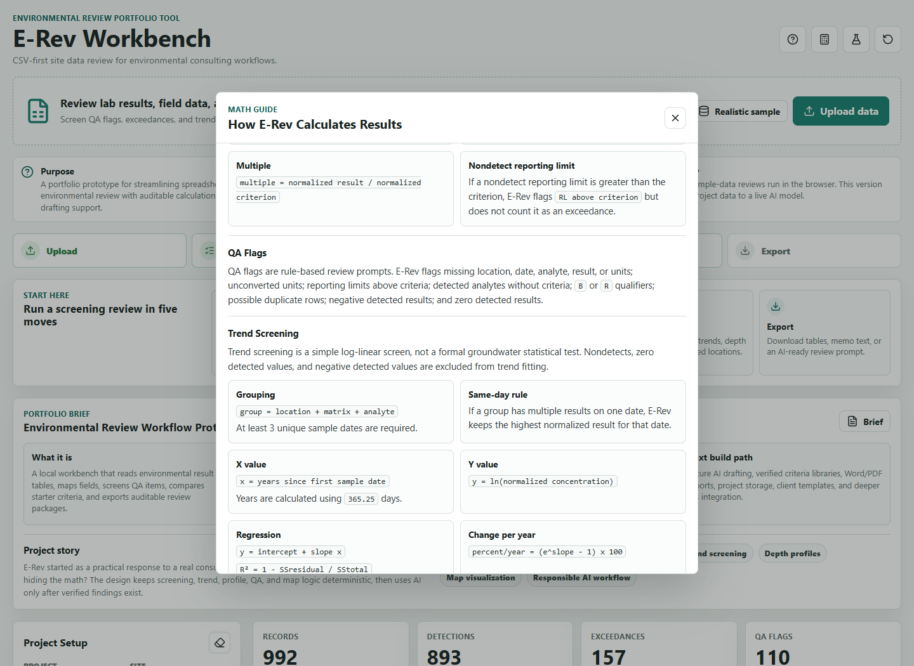
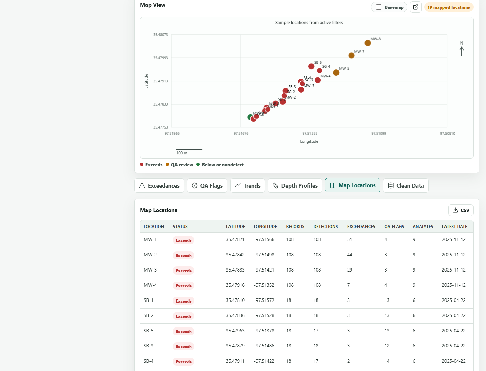

# E-Rev Workbench

**E-Rev Workbench** is a portfolio prototype for environmental consulting spreadsheet review. It explores how routine lab-result and field-data review could be made faster while keeping calculations visible, auditable, and separate from AI-generated narrative language.

The project focuses on a practical consulting workflow: upload environmental result tables, confirm detected fields, screen QA review items, compare starter criteria, review trends and depth profiles, map sample locations, and export review-ready summaries.

## Project Story

Environmental consulting work often starts with repetitive spreadsheet review before interpretation can begin: checking columns, filtering records, comparing criteria, reviewing QA concerns, building simple visuals, and drafting internal notes. E-Rev was built to test a responsible workflow where deterministic calculations come first and AI-supported drafting comes second.

The key design choice is that E-Rev owns the math. AI is positioned only as drafting support from verified E-Rev findings, not as the source of screening decisions.

## Screenshots







## What It Does

- Reads CSV, TSV, TXT, and browser-supported Excel files
- Detects common environmental data fields such as location, date, matrix, analyte, result, units, depth, latitude, and longitude
- Normalizes simple unit conversions for water, soil, sediment, air, and soil-gas review
- Compares results against editable starter screening criteria
- Flags spreadsheet-level QA review items
- Separates same-day boring intervals into depth profiles instead of time trends
- Builds first-pass log-linear trend screens from dated detected concentrations
- Plots mapped sample locations from latitude and longitude
- Exports active tables, memo text, AI-ready prompts, local AI assistant briefs, portfolio briefs, and self-contained HTML review packages

## Guides In The App

E-Rev includes two in-app reference dialogs:

- **Data Guide:** expected columns, file support, QA boundaries, filters, exports, mapping, criteria, and standards caveats
- **Math Guide:** formulas and rules for parsing, unit normalization, exceedance multiples, QA flags, trend screening, depth profiles, map projection, and filtered views

These guides are intentionally built into the interface so a reviewer can see what the app is doing without reading the source code.

## Responsible AI Positioning

The current static prototype does not call a live AI model and does not send project data to an external AI service. The AI-related features are local drafting aids:

- an AI-ready prompt built from deterministic E-Rev findings
- a local consultant-style draft brief
- a draft QA checker for missing counts, caveats, QA references, and overconfident regulatory language

A production version could add a secure backend for live AI drafting, but the backend would receive verified E-Rev findings rather than raw unchecked spreadsheet conclusions.

## Standards Boundary

E-Rev is a first-pass review assistant, not a finished regulatory tool. It does not perform:

- formal laboratory data validation
- QAPP/SAP compliance review
- full Data Quality Assessment
- human health or ecological risk assessment
- cleanup-level selection
- regulatory closure determinations
- formal groundwater statistical compliance testing
- plume modeling or geostatistics

Screening criteria in this prototype are placeholders for workflow testing. Real reviews should use verified federal, state, client, or project-specific criteria with documented sources, units, media, exposure assumptions, and effective dates.

## Data Support

Primary supported formats:

- CSV
- TSV
- TXT delimited tables

CSV, TSV, TXT, and built-in sample-data workflows run fully in the browser. Excel files can be uploaded when the browser can load the optional SheetJS parser from the internet. If Excel parsing is unavailable, save the worksheet as CSV and upload the CSV.

The app can skip common lab-export title or project-information rows by scoring likely header rows during import.

## Review Workflow

1. Upload data or load the realistic sample dataset.
2. Add project context.
3. Confirm detected field mapping.
4. Review QA flags before trusting tables or memo language.
5. Review the dashboard, exceedance table, trends, depth profiles, and mapped locations.
6. Use the Data Guide and Math Guide to verify assumptions.
7. Export tables, memo language, AI prompts, or a self-contained review package.

Filters apply to dashboard summaries, tables, trend choices, depth profiles, mapped locations, memo text, and CSV exports. When **Exceedances only** is active, tables narrow to exceedance records while trend and depth-profile charts preserve the full supporting series for any group containing an exceedance.

## Sample Data

The repository includes fictitious sample data for testing:

- `sample-data/sample-environmental-results.csv`
- `sample-data/large-realistic-environmental-results.csv`

The larger sample includes quarterly groundwater data, soil boring intervals, soil-gas results, reporting limits, qualifiers, coordinates, and groundwater elevations. It is generated from `sample-data/generate-realistic-sample.js`.

## Verification

The project includes regression and math audit checks:

- `tests/run-regression-tests.js` checks browser workflow behavior, header-row detection, depth interval handling, grouped trend behavior under **Exceedances only**, and clean-data preview messaging.
- `tests/run-math-audit.js` independently recomputes the large sample counts, unit conversions, exceedances, QA flags, trend statuses, depth profiles, mapped locations, and selected edge cases.

Current audited large-sample counts:

- 992 records
- 893 detections
- 157 exceedances
- 110 QA flags
- 70 trend series
- 36 depth profiles
- 19 mapped locations

Additional audit notes are in `share/E-Rev_Workbench_Audit_Notes.md`.

## Deployment

E-Rev is a static HTML, CSS, and JavaScript app with no required build step.

Recommended portfolio deployment:

1. Publish this repository with GitHub Pages from the `main` branch and `/ (root)` folder.
2. Keep `index.html` at the top level of the repository.
3. Use `DEPLOYMENT.md` for GitHub Pages and Netlify notes.

Core CSV/sample workflows run as static browser features. Optional online enhancements include Excel parsing, online basemap tiles, and Google Maps handoff.

## Project Structure

```text
index.html        Main app shell
styles.css        App styling
app.js            Data parsing, review logic, charts, exports, and guides
sample-data/      Fictitious environmental result datasets
share/            Portfolio brief, case study, audit notes, screenshots
tests/            Browser regression and independent math audit scripts
vendor/           Local icon library
DEPLOYMENT.md     Static hosting notes
```

## License

No open-source license is currently included. That means the code is visible for portfolio review, but reuse rights have not been granted.
