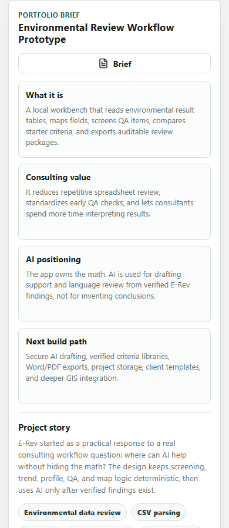

# E-Rev Workbench Portfolio Case Study

## Project Summary

E-Rev Workbench is a browser-based portfolio prototype for environmental consulting spreadsheet review. It reads site result tables, maps common environmental fields, screens QA review items, compares starter criteria, separates trend review from same-day depth profiles, plots sample locations, and exports review-ready summaries.

## Problem

Environmental consulting work often involves repetitive spreadsheet tasks before interpretation can begin: checking columns, filtering by matrix or analyte, reviewing QA flags, comparing against criteria, building quick visuals, and drafting internal notes. AI can help with narrative work, but only after the data checks are traceable.

## Approach

E-Rev keeps the math and screening logic deterministic. The app produces verified findings first, then supports AI drafting by generating an AI-ready prompt and local draft brief from those findings.

## What It Demonstrates

- Environmental data workflow design
- CSV intake and field detection
- QA flagging for common review issues
- Screening-level exceedance comparison
- Trend and depth-profile visualization
- Coordinate-based map review
- Exportable memo, prompt, and review package outputs
- Responsible AI boundaries for consulting work

## Screenshots

## Current Scope

The current version runs as a static browser app. CSV, TSV, TXT, and built-in sample-data workflows run locally in the browser. Excel parsing, online basemap tiles, and Google Maps handoff are optional online enhancements.

## Responsible AI Positioning

The current app does not call a live AI model. AI support is framed as drafting help after E-Rev has already calculated counts, flags, exceedances, trends, depth profiles, and map summaries. A production version would use a secure backend so project data and API keys are not exposed directly in the browser.

## Demo Path

1. Open E-Rev Workbench.
2. Load the realistic sample dataset.
3. Confirm detected fields and criteria caveats.
4. Review dashboard counts, QA flags, exceedances, trends, depth profiles, and map locations.
5. Filter to a location/analyte combination such as SB-3 Lead to explain why same-day soil boring intervals are depth profiles rather than time trends.
6. Export the review package or portfolio brief.

## Future Build Path

- Verified federal, state, client, and project-specific criteria libraries
- Secure live AI drafting through a backend
- Project/session save and version history
- Word/PDF exports aligned with client templates
- Reviewer signoff workflow
- Deeper GIS tools for wells, plumes, basemaps, and site context

## Caveats

The built-in sample data is fictitious. Starter screening criteria are placeholders. Trend labels and exceedance checks are first-pass review aids and are not regulatory conclusions.
